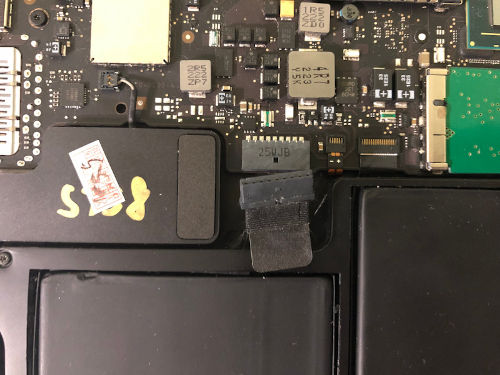

# Apple MacBook Air 5,2

This page describes how to run coreboot on MacBook Air 5,2, also known
as 13'' Mid 2012.

```eval_rst
+-------------+-------------+
| Model No.   | Motherboard |
+-------------+-------------+
| A1466       | 820-3209    |
+-------------+-------------+
```

## Flashing instructions

### External flashing

The board has one 8MB flash chip. It's WSON-8 so using clip is not
possible. To access the chip, you need to remove the motherboard as
it's located on the bottom side of the board.

The other way to access the flash chip is by using **J5100 debug port**
on the board and an **SPI adapter**. To access the port, remove the back
cover.


To access SPI flash chip through the debug port, you need an adapter.
One of possible options is A4052 Chipmunk Easy Flash. To use this one,
you also need 8-pin JST-SH 1.0mm male cable that plugs into this adapter's
8-pin header on the other side.


Connect the JST-SH cable's wires to your SPI programmer, **all except
VCC (3v3)**, then detach battery connector from the mainboard:



Plug the adapter:


The 3v3 pin of J5100 is not connected directly to the flash chip (U6100)
so it's not recommended to use it, as it's very unreliable and almost
never works. Instead, connect the 3v3 pin of your programmer to U7930's
3v3. It's wired directly to SPI chip:


Probe the chip with flashrom. If everything is set up correctly, flashrom
should detect the chip:

```
flashrom v1.1 on Linux 4.14.24-v7+ (armv7l)
flashrom is free software, get the source code at https://flashrom.org

Using clock_gettime for delay loops (clk_id: 1, resolution: 1ns).
Found Micron/Numonyx/ST flash chip "N25Q064..3E" (8192 kB, SPI) on linux_spi.
```

### Internal flashing

TODO

---

The flash layout of the OEM firmware is as follows:

```
00000000:00000fff fd
00190000:007fffff bios
00001000:0018ffff me
```

## Working

- 4GB model
- Linux 4.9 (Devuan)
- SeaBIOS
- GRUB
- Tianocore
- Wi-Fi
- S3 suspend and resume
- Both USB ports
- Trackpad
- libgfxinit
- me_cleaner
- Speakers
- ACPI support for battery, AC, lid (lid wakeup also works)
- SD card reader
- Camera
- Mic
- usbdebug (usb port on the left side)

## Untested

- Thunderbolt

## Known issues

- Bad sound in headphones.

## TODOs
- Support other memory configurations
- Fix headphones
