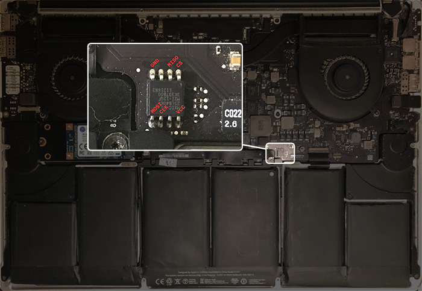

# Apple MacBook Pro 10,1

This page describes how to run coreboot on MacBook Pro 10,1, also known
as 15'' Mid 2012 with Retina Display.

```eval_rst
+-------------+-------------+
| Model No.   | Motherboard |
+-------------+-------------+
| A1398       | 820-3332    |
+-------------+-------------+
```

## Flashing instructions

The board has one 8MB Macronix flash chip. To access the chip, you need to
remove the back cover.



The flash layout of the OEM firmware is as follows:

    00000000:00000fff fd
    00190000:007fffff bios
    00001000:0018ffff me

## Working

- 8GB model
- libgfxinit
- VGA ROM loading
- Integrated GPU
- Discrete GPU
- SeaBIOS, GRUB, Tianocore
- Linux (devuan ascii, kernel 4.9)
- Wi-Fi
- Both USB ports
- Trackpad
- me_cleaner
- Integrated/Discrete graphics selection via nvramtool
- Camera
- Mic
- SD card reader
- Speaker
- usbdebug (the usb port on the right side)
- Backlight control via gmux (/sys/class/backlight/gmux_backlight)

## Untested

- Thunderbolt
- FireWire

## Known issues

- Bad sound in headphones

## TODOs
- Support other memory configurations
