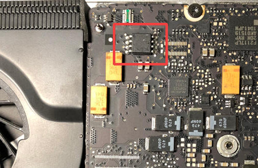
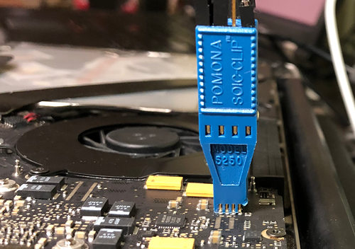

# Apple MacBook Pro 8,1

This page describes how to run coreboot on MacBook Pro 8,1, also known
as 13'' Early 2011.

```eval_rst
+-------------+-------------+
| Model No.   | Motherboard |
+-------------+-------------+
| A1278       | 820-2936    |
+-------------+-------------+
```

## Flashing instructions

The board has one 8MB 25Q064A flash chip. To access the chip, you need to
remove the back cover.



**If you're going to use a clip, read this!**

There is a resistor right near the VCC pin. It prevents the clip from
being properly attached. You can very easily break it. Either cut off
some plasic from the clip so that it wouldn't touch it, as shown below,
or don't use clip at all.



The flash layout of the OEM firmware is as follows:

    00000000:00000fff fd
    00190000:007fffff bios
    00001000:0018ffff me

## Working

- Both DIMMs
- libgfxinit
- SeaBIOS, GRUB
- Linux 4.15
- Wi-Fi
- Bluetooth
- ACPI-related stuff (lid, battery, AC)
- S3 suspend and resume
- Keyboard and touchpad
- USB 2.0 ports
- SD card reader
- Speakers and headphones
- Mic
- Camera
- CD-ROM
- Ethernet

## Untested

- Thunderbolt
- FireWire

## Known issues

None at the moment.
